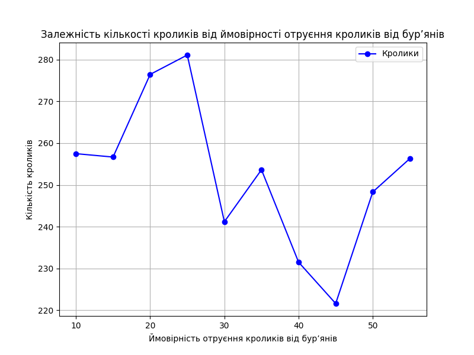

## Комп'ютерні системи імітаційного моделювання

## СПм-22-11, **Скиба Олександр Володимирович**

### Лабораторна робота №**2**. Редагування імітаційних моделей у середовищі NetLogo

 

### Варіант 6, модель у середовищі NetLogo:

[Rabbits Grass Weeds](http://www.netlogoweb.org/launch#http://www.netlogoweb.org/assets/modelslib/Sample%20Models/Biology/Rabbits%20Grass%20Weeds.nlogo)

 

### Внесені зміни у вихідну логіку моделі, за варіантом:

**Доданi новi параметри до моделi**

Замість
<pre>
rabbits-own [ energy ]
</pre>

Були додані необхідні для виконання завдання параметри:
<pre>
rabbits-own [ energy poisoned? recovery-time gender ]
globals [ poison-chance ]
</pre>

**Була перероблена go функцiя руху моделi**

Доданi новi умови для руху агентiв, якi враховують новi параметри такi як:

- отруєння
- час відновлення
- змiна кольору агента при отруєнні

<pre>
  ask rabbits
  [ if poisoned? 
    [ if recovery-time > 0 
      [ set recovery-time recovery-time - 1 set color orange]
      if recovery-time = 0 
      [ set poisoned? false
        set color white] ]  ; change color back to normal when recovered
    if not poisoned?
</pre>

Для отруєння використовується додаткова логiка в функцiї eat-grass:

<pre>
    if random-float 1.0 < poison-chance ;
    [ set poisoned? true
      set recovery-time 3 ] ] ;
</pre>

вирогiднiсть отруєння залежить від параметра poison-chance, яке ми встановили на 0.2

**Змiнено логiку розмноження агентiв**
Для цього була додана нова логiка, яка визначає чи може агент розмножитися,
враховуючи його стать та кiлькiсть енергiї.

Також була додана вирогiднiсть народження нового агента з параметром 0.5
<pre>
  if energy > birth-threshold and not poisoned? and any? other rabbits in-radius 1 with [gender != [gender] of myself and energy > birth-threshold and not poisoned?]
   [ if random-float 1.0 < 0.5 ; add 50% chance
    [ set energy energy / 2
      hatch 1 [ fd 1 set gender one-of ["male" "female"] ] ] ] ;
</pre>

### Внесені зміни у вихідну логіку моделі, на власний розсуд:

**Додано новий тип iїжi для агентiв - ягоди**
Імовірність встановлюється вручну через код середовища моделювання:
4 параметра такі як:

- berries-poison-chance - вирогiднiсть отруєння ягодою
- grass-poison-chance - вирогiднiсть отруєння травою
- berry-energy - кiлькiсть енергiї, яку дає ягода
- berries-grow-rate - швидкiсть росту ягiд

Для цього була додана нова функцiя, яка генерує ягоди на полi:
<pre>
to grow-berries
  ask patches [
    if pcolor = black [
      if random-float 1000 < berries-grow-rate
        [ set pcolor red ]
  ] ]
end
</pre>

Також було додано виклик функцiї grow-berries в setup и go функцiї:
<pre>
to setup
  clear-all
  grow-grass-and-weeds
  set-default-shape rabbits "rabbit"
  grow-berries ; задля росту ягiд на полi при запуску моделi
  ..........

to go
  if not any? rabbits [ stop ]
  grow-grass-and-weeds
  grow-berries ; задля росту ягiд на полi пiсля кожного кроку
  ..........
</pre>

Також буда додана нова процедура, яка визначає що агент може їсти ягоду:
<pre>
to eat-berries  ;; rabbit procedure
  ;; gain "berry-energy" by eating berries
  if pcolor = red
  [ set pcolor black
    set energy energy + berry-energy 
    if random-float 1.0 < berries-poison-chance ; добавлено вирогiднiсть отруєння ягодою
    [ set poisoned? true ; встановлено отруєння
      set recovery-time 3 ] ] ; встновлено час відновлення
end
</pre>

Додаємо можливість їсти ягоди в функцiю go:

<pre>
    if not poisoned? 
    [ move 
      eat-grass 
      eat-weeds 
      eat-berries ; додано можливість їсти ягоди 
      reproduce ]
    death ]
</pre>

3. Вплив ймовірності отруєння на середню кількість кроликів

Досліджується залежність кількостi кроликів протягом певної кількості тактів (100)
від шансу отруення вiд бур'яну.
Експерименти проводяться при 10 вiдсотках, з кроком 5, усього 10 симуляцій.
Інші керуючі параметри мають такi значення:

- **numer**: 150
- **grass-grow-rate**: 15
- **grass-energy**: 5
- **weeds-grow-rate**: 10
- **weed-energy**: 5
- **berry-energy**: 10
- **berries-grow-rate**: 2
- **berries-poison-chance**: 0.1
- **grass-poison-chance**: 0.05

<table>
<thead>
<tr><th>Ймовірність отруєння кроликів від бур’янів</th><th>Кількість кроликів</th></tr>
</thead>
<tbody>
<tr><td>10</td><td>257.49</td></tr>
<tr><td>15</td><td>256.68</td></tr>
<tr><td>20</td><td>276.46</td></tr>
<tr><td>25</td><td>281.1</td></tr>
<tr><td>30</td><td>241.2</td></tr>
<tr><td>35</td><td>253.64</td></tr>
<tr><td>40</td><td>231.52</td></tr>
<tr><td>45</td><td>221.62</td></tr>
<tr><td>50</td><td>248.33</td></tr>
<tr><td>55</td><td>256.32</td></tr>
</tbody>
</table>

Графік показує, що вплив отруєння на кроликів від бур’янів не дуже залежить від ймовірності отруєння.
